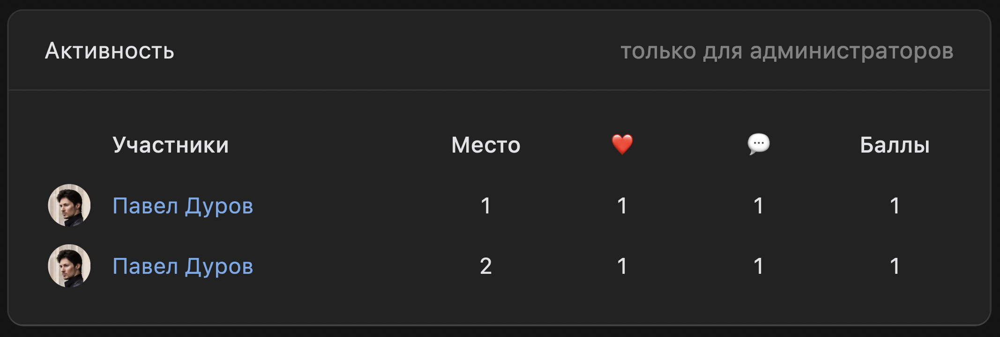

# Активность в сообществах

## Что это?
Это приложение, которое отслеживает активность пользователей
в сообществе по лайкам и комментариям. 

За каждый лайк и
комментарий сервис начисляет 1 и 2 балла соответственно.

Далее приложение отображает в [виджете для сообществ](https://dev.vk.com/api/community-apps-widgets/getting-started)
таблицу самых активных пользователей.

Так он выглядит:



## Начало работы для разработки

Переименуйте `.env.example` в `.env`.

Так как события в сообществах приложение получает через Callback API, необходимо
запустить туннель ngrok:
```shell
$ docker run -it ngrok/ngrok:2-alpine http 3000
```

Укажите в файле `.env` в поле `APP_DOMAIN` домен из ngrok. Например: `APP_DOMAIN="9084-X-X-X-X.ngrok.io"`

Запустите приложение:

```shell 
$ docker-compose up
```

## Дополнительно
Бекенд: Nest.js, PostgreSQL, Bull, VK-IO. Docker Compose для быстрого старта.

Фронтенд: React, VKUI.

Виджет обновляется через 15 секунд после поступления события в связи с ограничениями
API.
